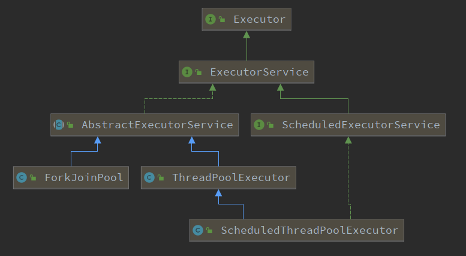
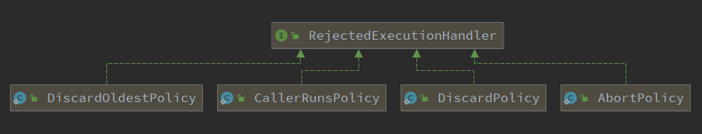

# JUC

- java.util.concurrent
- java.util.concurrent.atomic
- java.util.concurrent.lock

## 1. 线程相关

### 1.1 Future

### 1.2 创建线程

- 继承Thread类
- 实现Runnable接口，无返回值，不能抛出异常，实现run方法
- 实现Callable接口，有返回值，可以抛出异常，实现call方法
- 线程池创建（Executors）

## 2. 线程池

## 2.1 简介



## 2.2 Executors类

通过Executors.newXXXPool();方法创建线程池

常用API：

- Executors.newFixedThreadPool(int nThreads) 创建可重用且固定线程数的线程池，如果线程池中的所有线程都处于活动状态，此时再提交任务就在队列中等待，如果某个线程由于异常结束，线程池就会再补充一个。
- Executors.newSingleThreadExecutor() 创建只有一个线程的线程池，如果该线程因为异常而结束，就新建一个线程来继续执行。
- Executors.newCachedThreadPool() 创建可缓存的线程池，如果线程池中的线程在60秒内未被使用就移除。在执行新的任务时，当线程池中有之前创建的可用线程就直接重用，否则就新建一个线程。

阿里巴巴手册-泰山版规定不允许使用Executors创建线程的原因：

- Executors.newFixedThreadPool()和Executors.newSingleThreadExecutor()，使用的是LinkedBlockingQueue作为阻塞队列，此队列的最大容量为Integer.MAX_VALUE，可能会堆积大量的请求，从而导致OOM。
- Executors.newCachedThreadPool() 允许创建的最大线程数为Integer.MAX_VALUE，可能会导致创建大量的线程，从而导致OOM。
- 通过ThreadPoolExecutor的方式，更加明确线程池的运行规则，规避资源耗尽的风险。

## 2.3 ExecutorService

### 2.3.1 常用API

先说关闭，如果在main方法退出后，ExecutorService没有关闭，这个应用将一直运行。因为ExecutorService中运行的线程会阻止jvm关闭。

- shutdown() 调用后，ExecutorService不会立即关闭，而是不再接受新的任务，直到所有线程执行完成之后才会关闭，所有在shutdown()方法执行前提交的任务都会被执行。
- shutdownNow() 调用后，将跳过所有正在执行的任务和被提交但还未执行的任务，并且返回未被执行过的任务。

执行，**submit、invokeAny和invokeAll方法的内部，也是调用execute执行**

- void execute(Runnable command) 此方法是继承Executor接口得到的方法，无法获取返回值。
- Future<T> submit(Runnable task) 返回一个Future对象，可以检查提交的任务是否执行完毕，如果执行完毕future.get()会返回一个null。**注意，future.get()方法会产生阻塞。**
- Future<T> submit(Callable<T> task) 与上面类似，由于传入的是Callable，所以可以通过future.get()获取任务的执行结果。
- Future<T> submit(Runnable task,T result)
- <T> invokeAny(Collection<? extends Callable<T>> tasks) 接受一个Callable的集合，执行后返回其中一个Callable任务执行后的Future对象
- List<Future<T>> invokeAll(Collection<? extends Callable<T>> tasks) 接受一个Callable的集合，执行后返回所有Callable任务执行后的Future对象

## 2.4 ThreadPoolExecutor类

### 2.4.1 构造函数

```java
public ThreadPoolExecutor(int corePoolSize,
                          int maximumPoolSize,
                          long keepAliveTime,
                          TimeUnit unit,
                          BlockingQueue<Runnable> workQueue,
                          ThreadFactory threadFactory,
                          RejectedExecutionHandler handler)
```

- corePoolSize 核心线程数，线程池里面保持的线程数量（即使线程是空闲的）
- maximumPoolSize 最大线程数，线程池里允许的最大线程数量
- keepAliveTime 当线程池里的线程超过了corePoolSize，多出的线程在销毁之前等待新任务到来的最长时间
- unit keepAliveTime的单位
- workQueue 用来存放那些调用execute方法提交的但未执行的任务
- threadFactory 使用此工厂创建执行器需要的新鲜线程
- handler 阻塞队列达到了容量最大值时，执行器调用此处理器执行拒绝策略

### 2.4.2 拒绝策略



- AbortPolicy 默认的拒绝策略，丢弃任务并抛出RejectedExecutionException异常。
- DiscardPolicy 丢弃任务，但不抛弃异常。
- DiscardOldestPolicy 丢弃队列最前面的任务，不抛异常。
- CallerRunsPolicy 由调用线程池的线程（比如main线程）处理该任务，不抛异常，没有丢弃任务。

### 2.4.3 提交任务流程

1. 提交任务；
2. 判断核心线程数量是否达到corePoolSize，未到达则继续创建线程执行任务，是则执行3
3. 判断阻塞队列是否已满，未满则将任务存储在队列中，已满则执行4
4. 判断线程池中的线程数是否达到maximumPoolSize，未达到则继续创建线程执行任务，达到则执行5；
5. 按照拒绝策略处理提交的任务。

关键代码在ThreadPoolExecutor类中addWorker()、runWorker()方法


